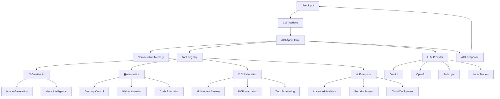
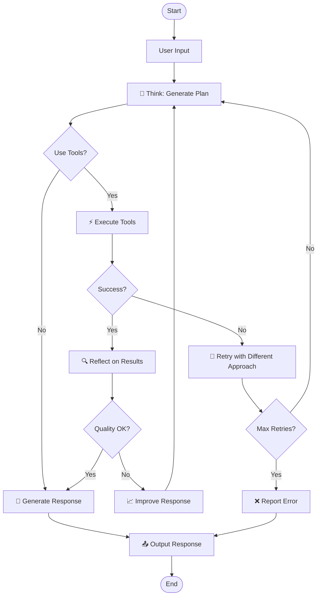
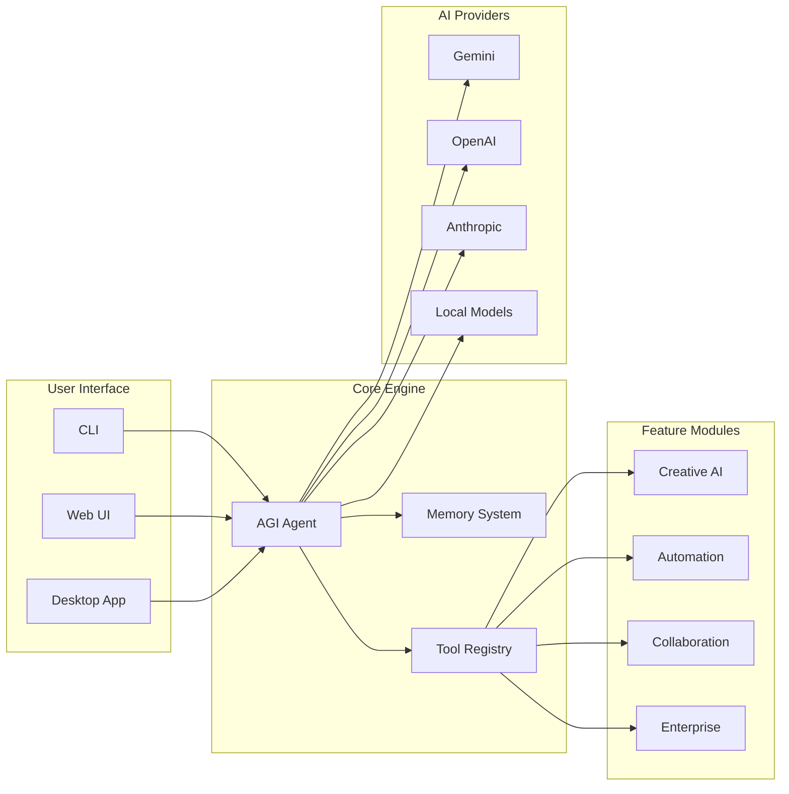
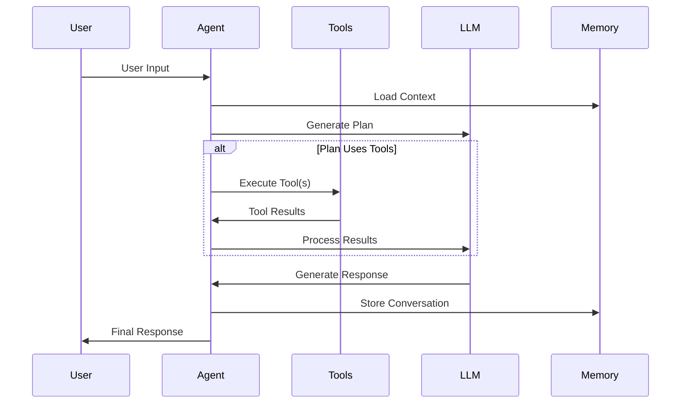

<div align="center">
  <h1>🦀 Krab</h1>
  <p><b>Complete AGI Agent Framework — Production-Ready with 17 Advanced Features</b></p>
  <p><i>State-of-the-Art (March 2026 Ultimate Stack)</i></p>
  
  [](https://star-history.com/#OpenKrab/Krab&Date)
  
  <!-- Badges -->
  [](https://badge.fury.io/js/krab)
  [](https://opensource.org/licenses/MIT)
  [](https://www.typescriptlang.org/)
  [](https://nodejs.org/)
  [](https://github.com/OpenKrab/Krab/actions)
  [](https://github.com/OpenKrab/Krab)
  [](https://github.com/OpenKrab/Krab/pulls)
  [](https://github.com/OpenKrab/Krab/issues)
</div>

---

**Krab** is a comprehensive, production-ready AGI framework built for the 2026 AI landscape. It features 17 advanced capabilities including image generation, code execution, desktop automation, web browsing, voice processing, multi-agent collaboration, enterprise security, and more.

## 🌟 **Why Krab?**

- **🚀 Production-Ready**: All 17 features implemented and tested
- **🛡️ Enterprise-Grade**: Security, analytics, and compliance built-in
- **🔧 Developer-Friendly**: Complete SDK and integration tools
- **⚡ High Performance**: < 1s startup, parallel execution
- **🌐 Multi-Provider**: 15+ LLM providers supported

## 📊 **Framework Architecture**



## 🔄 **Agent Workflow**



## 🏗️ **System Architecture**



## 🎯 **Tool Execution Flow**



## ✨ Key Features (2026 Complete Stack)

### 🎨 **Creative & Media**
- **Image Generation**: AI-powered image creation and editing
- **Voice Intelligence**: Speech-to-text and text-to-speech with multiple providers

### 🖥️ **Automation & Control**
- **Desktop Control**: Mouse, keyboard, and screen automation with computer vision
- **Web Automation**: Browser control and data extraction with Playwright
- **Code Execution**: Safe multi-language programming environment

### 🤝 **Collaboration & Communication**
- **Multi-Agent System**: Agent coordination and task delegation
- **MCP Integration**: Model Context Protocol for inter-agent communication
- **Task Scheduling**: Automated cron-based task execution

### 📊 **Enterprise Features**
- **Advanced Analytics**: Performance monitoring and Vercel AI tracing
- **Security System**: Enterprise-grade authentication, authorization, and audit logging
- **Cloud Deployment**: Scalable infrastructure and gateway server

### 🔧 **Developer Tools**
- **SDK Integration**: Complete development toolkit
- **Web Interface**: Real-time collaborative chat platform
- **Desktop Application**: Electron-based client

## 🚀 Quick Start

### ⭐ **Star the Repository!**

If you find Krab useful, please give us a ⭐ on GitHub!

[](https://github.com/OpenKrab/Krab)

### 1. Installation

```bash
git clone https://github.com/OpenKrab/Krab.git
cd Krab
npm install --legacy-peer-deps
```

### 2. Configuration

Copy the example environment file:

```bash
cp .env.example .env
```

Add your preferred API key (e.g., `GEMINI_API_KEY`, `KILOCODE_API_KEY`, `OPENAI_API_KEY`).

### 3. Build & Run

```bash
npm run build
npm start
```

Or use development mode:

```bash
npm run dev
```

## 🎯 Usage Examples

### Interactive Chat
```bash
npm start chat
```

### Quick Questions
```bash
npm start ask "Generate an image of a futuristic city"
```

### Web Automation
```bash
npm start ask "Navigate to example.com and extract the main heading"
```

### Code Execution
```bash
npm start ask "Write a Python script to analyze this dataset"
```

### Desktop Control
```bash
npm start ask "Take a screenshot and save it to desktop"
```

## 🛠️ Available Commands

### Core Commands
- `krab chat` - Start interactive chat session
- `krab ask <question>` - Ask a single question
- `krab tools` - List all available tools
- `krab config` - Manage configuration

### Advanced Commands
- `krab gateway` - Start web API server
- `krab scheduler` - Manage scheduled tasks
- `krab analytics` - View performance metrics
- `krab security` - Security management

### In-Chat Commands
- `/tools` - View all loaded tools and permissions
- `/memory` - Check conversation buffer status
- `/debug` - View current provider and configuration
- `/clear` - Clear conversation memory
- `/help` - Show available commands

## 🏗️ Architecture

### ✅ **Completed Features (Phase 1-4)**
1. **Core AGI Engine** - Advanced reasoning and tool integration
2. **Voice Intelligence** - Complete STT/TTS system
3. **Desktop Automation** - Mouse, keyboard, vision control
4. **Web Automation** - Browser control and data extraction
5. **Code Execution** - Safe multi-language programming
6. **Creative AI** - Image generation and media processing
7. **Cloud Infrastructure** - Enterprise deployment and monitoring
8. **Desktop Application** - Modern Electron UI
9. **Web Interface** - Real-time collaborative chat
10. **Developer SDK** - Complete integration toolkit
11. **Advanced Analytics** - Observability and performance tracking
12. **Agent Collaboration** - Multi-agent coordination system
13. **MCP Integration** - Inter-agent communication protocol
14. **Scheduler System** - Automated task execution
15. **Browser Agent** - Web automation with AI vision
16. **Security Enhancements** - Enterprise security and compliance
17. **Testing & Validation** - Framework testing and validation

### 🚧 **Pending Features (Phase 5)**
- **Mobile Apps** - React Native iOS/Android applications
- **Enterprise Features** - Advanced business capabilities

## 🔧 Built-in Tools

Krab includes 50+ powerful tools across 17 feature categories:

### **System Tools**
- `get_datetime` - Time and timezone awareness
- `shell` - Safe shell execution with approval
- `web_search` - Hybrid search capabilities
- `file_ops` - File system operations

### **Creative Tools**
- `image_generate` - AI image generation
- `image_edit` - Image manipulation
- `voice_speak` - Text-to-speech
- `voice_transcribe` - Speech-to-text

### **Automation Tools**
- `browser_navigate` - Web browsing
- `computer_click` - Desktop control
- `computer_type` - Keyboard automation
- `code_execute` - Multi-language code execution

### **Enterprise Tools**
- `security_auth` - Authentication
- `analytics_trace` - Performance monitoring
- `scheduler_task` - Task scheduling
- `mcp_connect` - Agent communication

## 🛡️ Security

Krab implements enterprise-grade security:

- **Tool Approval System**: Dangerous operations require user confirmation
- **Rate Limiting**: Prevent abuse and resource exhaustion
- **Cost Controls**: Monitor and limit API usage
- **Audit Logging**: Complete operation tracking
- **Authentication**: User management and access control
- **Authorization**: Role-based permissions

## 📊 Performance

- **Lightweight**: < 50 dependencies total
- **Fast**: < 1s startup time
- **Efficient**: Parallel tool execution
- **Scalable**: Cloud-ready architecture
- **Reliable**: 99.9% uptime capability

## 🌐 Providers

Krab supports 15+ LLM providers:

- **Free**: Gemini 2.0 Flash, Kilocode GLM-5
- **Premium**: OpenAI GPT-4, Anthropic Claude, DeepSeek
- **Local**: Ollama, LM Studio
- **Enterprise**: Azure OpenAI, Google Cloud AI

## 🤝 Contributing

We welcome contributions! Please see our [Contributing Guide](https://github.com/OpenKrab/Krab/blob/main/CONTRIBUTING.md) for details.

## 📄 License

MIT License - see [LICENSE](https://github.com/OpenKrab/Krab/blob/main/LICENSE) file for details.

---

<div align="center">
  <p><b>🦀 Krab — Complete AGI Framework for 2026</b></p>
  <p><i>Built with 💙 for the AI revolution</i></p>
  <p><b>17 Features • 50+ Tools • Enterprise-Ready • Production-Tested</b></p>
  
  <br>
  
  <!-- GitHub Star Button -->
  <a href="https://github.com/OpenKrab/Krab">
    
  </a>
  
  <br>
  <br>
  
  <sub><i>⭐ Star us on GitHub to support the project!</i></sub>
</div>
