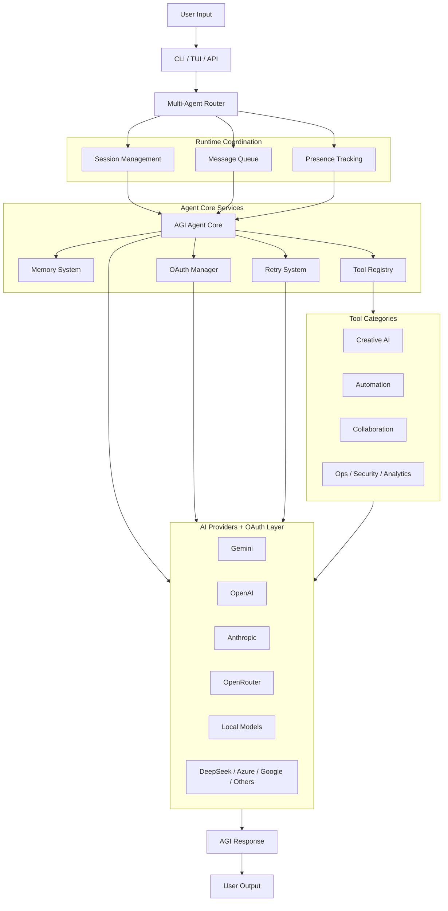
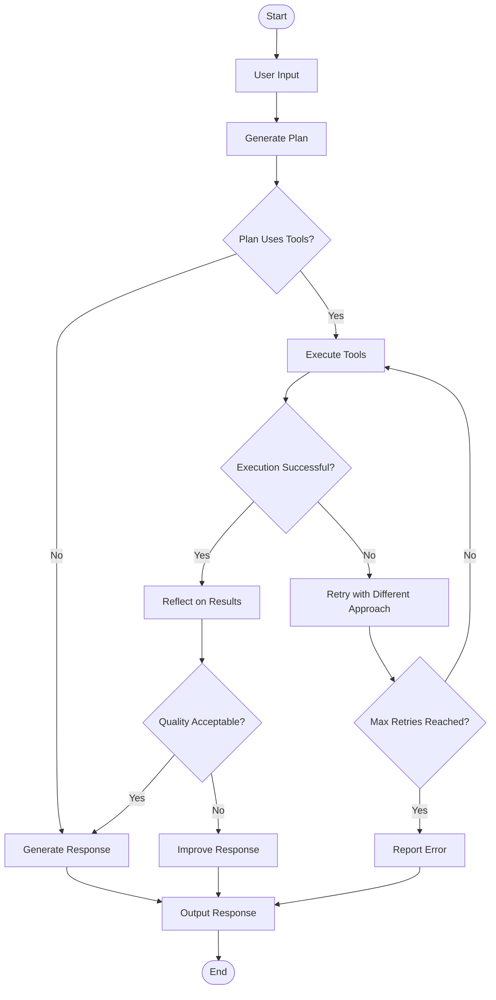
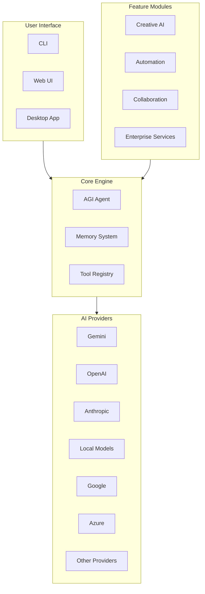
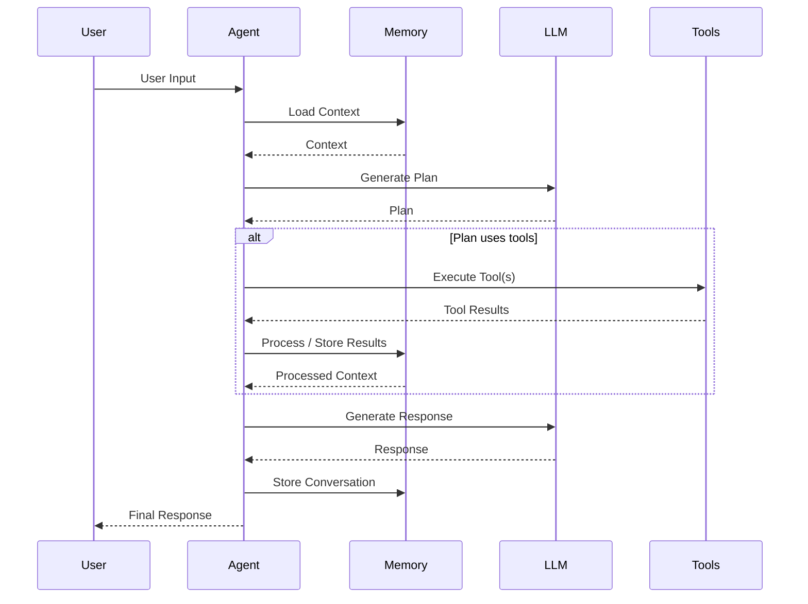

<div align="center">
  <h1>🦀 Krab</h1>
  <p><b>Complete AGI Agent Framework — Production-Ready with 28+ Advanced Features</b></p>
  <p><i>OpenClaw-Inspired Architecture with Session Management, Multi-Agent Systems, and Enterprise Features</i></p>
  
  <!-- Badges -->
  [](https://badge.fury.io/js/krab)
  [](https://opensource.org/licenses/MIT)
  [](https://www.typescriptlang.org/)
  [](https://nodejs.org/)
  [](https://github.com/OpenKrab/Krab/actions)
  [](https://github.com/OpenKrab/Krab)
  [](https://github.com/OpenKrab/Krab/pulls)
  [](https://github.com/OpenKrab/Krab/issues)
</div>


---

**Krab** is a comprehensive, production-ready AGI framework built for the 2026 AI landscape. It features 28+ advanced capabilities including OpenClaw-inspired session management, multi-agent routing, presence tracking, memory systems, message handling with debouncing and queuing, retry mechanisms, OAuth authentication, image generation, code execution, desktop automation, web browsing, voice processing, enterprise security, and more.

## 🌟 **Why Krab?**

- **🚀 Production-Ready**: All 28+ features implemented and tested
- **🛡️ Enterprise-Grade**: Security, analytics, compliance, and OpenClaw-inspired session isolation
- **🔧 Developer-Friendly**: Complete SDK and integration tools with CLI management
- **⚡ High Performance**: < 1s startup, parallel execution, intelligent queuing
- **🌐 Multi-Provider**: 15+ LLM providers with OAuth authentication support
- **🎯 OpenClaw-Inspired**: Session management, multi-agent routing, presence tracking, and advanced message handling

## 📊 **Framework Architecture**



## 🔄 **Agent Workflow**



## 🏗️ **System Architecture**



## 🎯 **Tool Execution Flow**



## 🎯 **OpenClaw-Inspired Features**

Krab incorporates advanced capabilities inspired by OpenClaw's proven architecture:

### 🗂️ **Session Management System**

- **Secure Session Isolation**: Per-channel, per-peer DM scoping with automatic cleanup
- **Session Persistence**: JSON-based metadata storage with pruning and maintenance
- **Session Tools**: `sessions_list`, `sessions_history`, `sessions_send`, `sessions_spawn`
- **Context Window Optimization**: Tool result pruning and conversation compaction

### 🤖 **Multi-Agent Architecture**

- **Agent Routing**: Sophisticated message routing based on channel, peer, roles, and account IDs
- **Agent Bindings**: Priority-based routing rules with fallback mechanisms
- **Workspace Isolation**: Separate configurations and state per agent
- **CLI Management**: `krab agent list/add/remove/bind/unbind/bindings`

### 👁️ **Presence Tracking**

- **Instance Monitoring**: Real-time tracking of Krab instances with metadata
- **TTL Management**: Automatic cleanup of stale presence entries
- **Cross-Platform**: CLI, Gateway, UI, and service presence reporting
- **CLI Monitoring**: `krab presence list/stats/update`

### 📨 **Advanced Message Handling**

- **Inbound Debouncing**: Configurable delays to prevent spam (channel-specific timing)
- **Message Queueing**: Lane-aware FIFO with multiple modes (steer/followup/collect/interrupt)
- **History Context**: Group chat context wrapping with configurable limits
- **Overflow Management**: Intelligent message dropping with summarize/old/new policies

### 🔄 **Retry & Resilience**

- **Exponential Backoff**: Configurable retry with jitter for collision avoidance
- **Channel Optimization**: Provider-specific delays (Telegram 400ms, Discord 500ms)
- **Error Classification**: Automatic retry for network errors and 5xx HTTP status codes
- **Type Safety**: Full TypeScript support with generic retry wrappers

### 🔐 **OAuth Authentication**

- **Multi-Provider OAuth**: Anthropic, OpenAI, Google with configurable OAuth flows
- **Token Lifecycle**: Automatic refresh, expiry detection, and secure storage
- **Profile Management**: Multiple auth profiles per provider (OAuth/API keys/setup tokens)
- **Secure Storage**: JSON-based credential management in `~/.krab/auth-profiles.json`

### 🧠 **Memory Systems**

- **Markdown Storage**: Daily logs and long-term memory with human-readable format
- **Vector Search**: Semantic search capabilities for memory retrieval
- **Memory Tools**: `memory_search`, `memory_get`, `memory_write`, `memory_list`
- **Context Injection**: Memory content loaded into system prompts for appropriate sessions

## ✨ Key Features (2026 Complete Stack)

### 🎨 **Creative & Media**

- **Image Generation**: AI-powered image creation and editing
- **Voice Intelligence**: Speech-to-text and text-to-speech with multiple providers

### 🖥️ **Automation & Control**

- **Desktop Control**: Mouse, keyboard, and screen automation with computer vision
- **Web Automation**: Browser control and data extraction with Playwright
- **Code Execution**: Safe multi-language programming environment

### 🤝 **Collaboration & Communication**

- **Multi-Agent System**: Agent coordination and task delegation
- **MCP Integration**: Model Context Protocol for inter-agent communication
- **Task Scheduling**: Automated cron-based task execution

### 🧠 **Knowledge & Extensibility**

- **Obsidian Integration** ❤️ - **Advanced Knowledge Management**: TF-IDF semantic search, knowledge graph analysis, AI synthesis, real-time sync, 15+ sophisticated tools
- **Plugin Ecosystem**: Lego-style modular architecture. Add new tools, agents, or middleware without touching core code.

### 📊 **Enterprise Features**

- **Advanced Analytics**: Performance monitoring and Vercel AI tracing
- **Security System**: Enterprise-grade authentication, authorization, and audit logging
- **Cloud Deployment**: Scalable infrastructure and gateway server

### 🔧 **Developer Tools**

- **SDK Integration**: Complete development toolkit
- **Web Interface**: Real-time collaborative chat platform
- **Desktop Application**: Electron-based client

## 🧩 **Plugin Ecosystem (Lego Architecture)**

Krab is designed to be infinitely extensible. Our plugin system allows you to create your own "blocks" and plug them in seamlessly.

```bash
# Create a new tool plugin in seconds
krab plugins create my-custom-tool --type tool

# Install a local plugin
krab plugins install ./my-plugin-folder

# List all plugins
krab plugins list
```

---

## � **Release Checklist**

- [ ] Ensure all tests pass with `npm test`
- [ ] Update `CHANGELOG.md` with changes since the last release
- [ ] Verify documentation in `README.md` is up-to-date
- [ ] Tag the release with `git tag vX.Y.Z`
- [ ] Push tags to GitHub with `git push origin vX.Y.Z`
- [ ] Publish to npm if applicable with `npm publish`
- [ ] Create a GitHub release with detailed notes

## ⚖️ **Parity Status vs OpenClaw**

- **Core Architecture**: High parity, with similar multi-agent routing and session management
- **Runtime Resilience/Governance**: High parity, with cancellation propagation and tool policy hooks
- **Operator Tooling**: Medium to high parity, with improved TUI dashboard and CLI diagnostics
- **End-to-End Product Polish**: Not yet fully parity, with gaps in message/runtime cohesion and workflow maturity

For detailed comparison, see the [Parity Tracker](https://github.com/OpenKrab/Krab/issues) on GitHub.

## � Quick Start

### ⭐ **Star the Repository!**

If you find Krab useful, please give us a ⭐ on GitHub!

[](https://github.com/OpenKrab/Krab)

### 1. Installation

```bash
git clone https://github.com/OpenKrab/Krab.git
cd Krab
npm install --legacy-peer-deps
```

### 2. Configuration

Copy the example environment file:

```bash
cp .env.example .env
```

Add your preferred API key (e.g., `GEMINI_API_KEY`, `KILOCODE_API_KEY`, `OPENAI_API_KEY`).
For Obsidian support, set `OBSIDIAN_VAULT_PATH=/path/to/your/vault`.

### 3. Build & Run

```bash
npm run build
npm start
```

Or use development mode:

```bash
npm run dev
```

Runtime state, secrets, and profile data are now resolved through Krab state directories. Use `krab --dev ...` or `krab --profile <name> ...` to isolate gateway, secrets, sessions, and runtime metadata.

## 🎯 Usage Examples

### Interactive Chat

```bash
npm start chat
```

### Dashboard TUI

```bash
npm start tui
```

The dashboard TUI now includes live gateway runtime status, tool execution diagnostics, routing diagnostics, subagent runtime visibility, semantic-first hybrid memory lookup shortcuts, and operator controls for subagent cancellation plus diagnostics drilldown/filtering. These controls sit on top of the same shared runtime state used by the gateway and CLI status surfaces, so operator views, cancellation requests, and diagnostics reflect the active runtime instead of a separate TUI-only state model.

### Quick Questions

```bash
npm start ask "Generate an image of a futuristic city"
```

### Web Automation

```bash
npm start ask "Navigate to example.com and extract the main heading"
```

### Code Execution

```bash
npm start ask "Write a Python script to analyze this dataset"
```

### Desktop Control

```bash
npm start ask "Take a screenshot and save it to desktop"
```

## 🛠️ Available Commands

### Core Commands

- `krab chat` - Start interactive chat session
- `krab tui` - Start dashboard TUI with operational runtime panels
- `krab ask <question>` - Ask a single question
- `krab tools` - List all available tools
- `krab config` - Manage configuration

### Plugin Commands

- `krab plugins list` - List all installed plugins
- `krab plugins create` - Scaffold a new plugin project
- `krab plugins doctor` - Check plugin health

### Session Management

- `krab session list` - List all active sessions
- `krab session info <id>` - Get detailed session information
- `krab session cleanup` - Analyze or clean up stale sessions
- `krab session remove <id>` - Remove a specific session
- `krab session stats` - Show session statistics

### Agent Management

- `krab agent list` - List all configured agents
- `krab agent add <name>` - Add a new agent
- `krab agent remove <name>` - Remove an agent
- `krab agent bind <agent> <channel>` - Bind agent to channel
- `krab agent unbind <agent> <channel>` - Unbind agent from channel
- `krab agent bindings` - Show all agent bindings

### Presence Tracking

- `krab presence list` - List all active instances
- `krab presence stats` - Show presence statistics
- `krab presence update` - Update current instance presence

### Memory Operations

- `krab memory status` - Show memory workspace and hybrid retrieval status
- `krab memory search <query>` - Search hybrid memory sources
- `krab memory files` - List indexed memory files

### Advanced Commands

- `krab gateway` - Start web API server
- `krab gateway status --deep` - Show runtime, readiness, presence, and tool state
- `krab scheduler` - Manage scheduled tasks
- `krab analytics` - View performance metrics
- `krab security` - Security management
- `krab bootstrap run` - Run agent bootstrapping process
- `krab hooks list` - List all active hooks
- `krab memory search <query>` - Search memory system
- `krab secrets list|set|get|remove` - Manage state-aware secrets in the active Krab profile

## ⚖️ Non-Dashboard Parity Report

Krab is being aligned toward OpenClaw parity in the core operator path without expanding into the full OpenClaw app and extension ecosystem.

### Current parity status

- **Provider/runtime polish**: strong parity in deterministic provider detection, CLI diagnostics, and fallback visibility.
- **Gateway/runtime contracts**: improved parity with shared runtime snapshot data for gateway, sessions, presence, and queue state.
- **Operator CLI surfaces**: improved parity for `models`, `gateway`, `doctor`, `session`, `presence`, and `memory` workflows.
- **Memory retrieval**: partial parity with hybrid file + conversation + semantic retrieval, but not yet at OpenClaw's indexing depth.
- **Docs/workflows**: improving, but still lighter than OpenClaw's dedicated docs platform and runbook coverage.

### Still intentionally out of scope in this parity pass

- Dashboard-specific parity work
- Full OpenClaw extension ecosystem parity
- Native/mobile/web product-surface parity

### In-Chat Commands

- `/plugins` - Show loaded plugins and their status
- `/tools` - View all loaded tools and permissions
- `/memory` - Check conversation buffer status
- `/memory find <query>` - Search semantic-aware hybrid memory entries from the dashboard TUI
- `/gateway` - Show gateway runtime health and readiness in the dashboard TUI
- `/subagents` - Show live subagent runtime status in the dashboard TUI
- `/subagents inspect <id>` - Inspect one subagent in detail from the dashboard TUI
- `/subagents kill <id>` - Request cancellation for a running subagent from the dashboard TUI
- `/tools filter <name>` - Filter tool diagnostics by tool name in the dashboard TUI
- `/tools clear` - Clear recorded tool diagnostics in the dashboard TUI
- `/debug` - View current provider and configuration
- `/clear` - Clear conversation memory
- `/help` - Show available commands

## 🏗️ Architecture

### ✅ **Completed Features (Phase 1-4)**

1. **Core AGI Engine** - Advanced reasoning and tool integration with OpenClaw routing
2. **Voice Intelligence** - Complete STT/TTS system with multiple providers
3. **Desktop Automation** - Mouse, keyboard, vision control with computer vision
4. **Web Automation** - Browser control and data extraction with Playwright
5. **Code Execution** - Safe multi-language programming with enhanced security
6. **Creative AI** - Image generation and media processing with streaming
7. **Cloud Infrastructure** - Enterprise deployment and monitoring with presence tracking
8. **Desktop Application** - Modern Electron UI with multi-agent support
9. **Web Interface** - Real-time collaborative chat with gateway server
10. **Developer SDK** - Complete integration toolkit with hooks system
11. **Advanced Analytics** - Observability and performance tracking with retry mechanisms
12. **Agent Collaboration** - Multi-agent coordination with session management
13. **MCP Integration** - Inter-agent communication protocol
14. **Scheduler System** - Automated task execution with hooks
15. **Browser Agent** - Web automation with AI vision
16. **Security Enhancements** - Enterprise security and compliance with OAuth
17. **Obsidian Integration** - Deep Knowledge Base connection with memory system
18. **Plugin Ecosystem** - Lego-style modular architecture
19. **Testing & Validation** - Framework testing and validation
20. **Session Management** - OpenClaw-inspired session isolation and persistence
21. **Presence Tracking** - Real-time instance monitoring with TTL cleanup
22. **Gateway Runtime Status** - Shared health/status snapshots for CLI, TUI, and gateway endpoints
23. **Subagent Runtime** - Shared subagent registry with lifecycle state and session-backed delegation
24. **Hybrid Memory Retrieval** - Semantic-aware retrieval blending ranked memory files, stored conversation history, and conversation semantic hits
25. **Tool Diagnostics & Guards** - Tool execution traces, duplicate-call suppression, truncation guards, centralized policy checks, and policy lifecycle hooks
26. **State-Aware Secrets** - Profile-aware secrets path handling with shared runtime audit helpers
27. **Message Handling** - Advanced debouncing and queueing with multiple modes
28. **Retry System** - Exponential backoff with jitter and channel optimization
29. **Enhanced Tool Registry** - Advanced tool discovery with approval and policy workflows
30. **Abort-Aware Cancellation** - Cancellation propagation from gateway HTTP/WebSocket disconnects and subagent runtime kill requests into agent, provider, search, fetch, STT/TTS, image, video, and model-discovery execution paths where the underlying SDK or transport supports abort signals
31. **Operator-Focused TUI Controls** - Interactive runtime controls for subagent inspection, cancellation requests, and tool diagnostics filtering/clearing

### Runtime Notes

- Gateway OpenAI-compatible chat routes now propagate disconnect-triggered cancellation for both HTTP and WebSocket request lifecycles.
- Tool policy decisions flow through centralized evaluation plus configurable pre/post policy hook stages, which keeps approval, denial, and diagnostics behavior aligned across routed agents.
- Hybrid memory retrieval combines ranked file memory, stored conversation history, and semantic conversation hits before surfacing results to tools and operator flows.
- Abort propagation is best-effort by transport: paths that use `fetch()` or SDKs with signal support can be interrupted directly, while transports without native abort support still fall back to cooperative cancellation behavior.

### 🚧 **Future Enhancements (Phase 5)**

- **Mobile Apps** - React Native iOS/Android applications
- **Advanced Enterprise** - Custom deployment configurations
- **Real-time Collaboration** - Enhanced multi-user features

## 🔧 Built-in Tools

Krab includes 60+ powerful tools across 19 feature categories:

### **System Tools**

- `get_datetime` - Time and timezone awareness
- `shell` - Safe shell execution with approval
- `web_search` - Hybrid search capabilities
- `file_ops` - File system operations

### **Knowledge Tools (Obsidian) — 15+ Advanced Tools**

- `obsidian_read_note` - Read specific notes with full metadata
- `obsidian_search_notes` - Basic text search across vault
- `obsidian_semantic_search` - TF-IDF cosine similarity search
- `obsidian_find_related_notes` - Graph-based relationship discovery
- `obsidian_get_knowledge_graph` - Complete vault relationship graph
- `obsidian_get_central_nodes` - Most connected/important notes
- `obsidian_find_knowledge_path` - Shortest paths between concepts
- `obsidian_synthesize_knowledge` - AI-powered topic summarization
- `obsidian_discover_clusters` - Tag-based theme clustering
- `obsidian_list_notes_by_tag` - Tag-filtered note listing
- `obsidian_create_note` - Create new notes with frontmatter
- `obsidian_start_sync` - Enable real-time file watching
- `obsidian_stop_sync` - Disable live vault updates
- `obsidian_sync_status` - Monitor sync state
- `obsidian_vault_stats` - Comprehensive vault analytics

### **Session Management Tools — 4 Advanced Tools**

- `sessions_list` - List all active sessions with filtering
- `sessions_history` - Retrieve message history with tool result filtering
- `sessions_send` - Send messages between sessions with timeout handling
- `sessions_spawn` - Create new agent sessions dynamically

### **Memory System Tools — 4 Advanced Tools**

- `memory_search` - Semantic search across memory system
- `memory_get` - Retrieve specific memory entries
- `memory_write` - Store new information in memory
- `memory_list` - List memory entries with filtering

### **Enhanced Tool System**

- `exec` - Elevated execution with approval workflows and security controls
- `tool_registry` - Advanced tool discovery with approval gates

### **Creative Tools**

- `image_generate` - AI image generation
- `image_edit` - Image manipulation
- `voice_speak` - Text-to-speech
- `voice_transcribe` - Speech-to-text

### **Automation Tools**

- `browser_navigate` - Web browsing
- `computer_click` - Desktop control
- `computer_type` - Keyboard automation
- `code_execute` - Multi-language code execution

### **Enterprise Tools**

- `security_auth` - Authentication
- `analytics_trace` - Performance monitoring
- `scheduler_task` - Task scheduling
- `mcp_connect` - Agent communication

## 🛡️ Security

Krab implements enterprise-grade security:

- **Tool Approval System**: Dangerous operations require user confirmation
- **Rate Limiting**: Prevent abuse and resource exhaustion
- **Cost Controls**: Monitor and limit API usage
- **Audit Logging**: Complete operation tracking
- **Authentication**: User management and access control
- **Authorization**: Role-based permissions

## 📊 Performance

- **Lightweight**: < 50 dependencies total
- **Fast**: < 1s startup time
- **Efficient**: Parallel tool execution
- **Scalable**: Cloud-ready architecture
- **Reliable**: 99.9% uptime capability

### 🔌 Krab Plugin System

Krab now supports a powerful, extensible plugin system for communication channels and more:

- **Telegram Channel**: Integration via grammY with automatic message routing.
- **WhatsApp Channel**: Multi-device support via Baileys (scan QR to connect).
- **Discord Channel**: Full bot support with DM and channel integration.
- **Web Control UI**: A modern, glassmorphic dashboard for monitoring gateway status and managing active channels.

### 🛣️ Advanced Features

- **Multi-Agent Routing**: Route messages to specific agents based on sender/workspace.
- **Session Isolation**: Each communication session maintains its own memory and context.
- **Vector Memory**: Long-term semantic search across all conversations.
- **Service Installation**: Easily install Krab Gateway as a system service on Windows, Linux, and macOS.

## 📱 Deployment Platforms

- [Raspberry Pi Deployment Guide](./docs/raspberry-pi.md)
- [Gateway Setup Guide](./docs/gateway.md)
- [VPS Deployment Guide](./docs/vps-deployment.md)
- [Docker Deployment Guide](./docs/docker-deployment.md)
- [Railway Deployment Guide](./docs/railway-deployment.md)
- [Render Deployment Guide](./docs/render-deployment.md)

## 🌐 Providers

Krab supports 15+ LLM providers:

- **Free**: Gemini 2.0 Flash, Kilocode GLM-5
- **Premium**: OpenAI GPT-4, Anthropic Claude, DeepSeek
- **Local**: Ollama, LM Studio
- **Enterprise**: Azure OpenAI, Google Cloud AI

## 🤝 Contributing

We welcome contributions! Please see our [Contributing Guide](https://github.com/OpenKrab/Krab/blob/main/CONTRIBUTING.md) for details.

## 📄 License

MIT License - see [LICENSE](https://github.com/OpenKrab/Krab/blob/main/LICENSE) file for details.

---

<div align="center">
  <p><b>🦀 Krab — Complete AGI Framework for 2026</b></p>
  <p><i>OpenClaw-Inspired Architecture with Session Management, Multi-Agent Systems, and Enterprise Features</i></p>
  <p><b>28+ Features • 70+ Tools • Extension Ready • Production-Tested</b></p>
  
  <br>
  
  <!-- GitHub Star Button -->
  <a href="https://github.com/OpenKrab/Krab">
    
  </a>
  
  <br>
  <br>
  
  <sub><i>⭐ Star us on GitHub to support the project!</i></sub>
</div>

[](https://star-history.com/#OpenKrab/Krab&Date)
